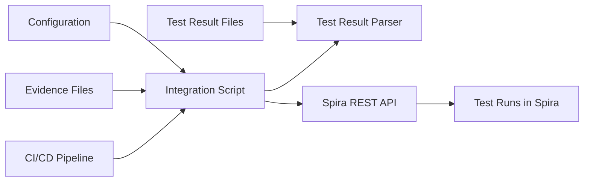
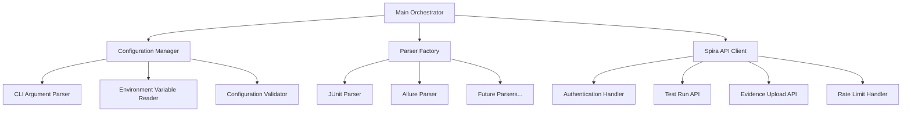

# Design Document: CI/CD Spira Test Integration

## Overview

This design specifies a Python-based CLI tool that integrates test execution results from CI/CD pipelines into the Spira test management system. The tool operates as a pipeline stage, parsing test results from various frameworks (TestNG/JUnit, Cypress/Allure) and transmitting them to Spira via REST API.

### Key Design Goals

1. **Pluggable Architecture**: Support multiple test result formats through a parser plugin system
2. **CI/CD Native**: Operate seamlessly in GitHub Actions, GitLab CI, and Jenkins environments
3. **Secure by Default**: Externalize all credentials and sensitive configuration
4. **Robust Error Handling**: Gracefully handle API failures, missing files, and malformed data
5. **Observable**: Provide clear logging and execution summaries for pipeline visibility

### MVP Scope

The MVP implementation focuses on:
- JUnit XML parser (TestNG compatibility)
- Allure JSON parser (Cypress compatibility)
- Spira REST API integration with authentication
- Evidence attachment handling (screenshots, videos, logs)
- Configuration via CLI arguments and environment variables
- Comprehensive error handling and logging

### Future Extensions

The architecture supports future additions:
- pytest JSON parser
- Cucumber Messages parser
- Additional evidence formats
- Advanced mapping strategies (regex, fuzzy matching)

## Architecture

### System Context



### Component Architecture



### Design Principles

1. **Separation of Concerns**: Each component has a single, well-defined responsibility
2. **Dependency Injection**: Components receive dependencies rather than creating them
3. **Interface-Based Design**: Parsers implement a common interface for extensibility
4. **Fail-Fast Validation**: Configuration and input validation occurs early
5. **Defensive Programming**: Validate all external inputs and API responses

## Components and Interfaces

### 1. Main Orchestrator

**Responsibility**: Coordinate the overall execution flow

**Key Operations**:
- Initialize configuration manager
- Load and validate configuration
- Instantiate appropriate parser based on result type
- Parse test results
- Map test cases to Spira identifiers
- Send results to Spira via API client
- Generate execution summary

**Error Handling**:
- Catch and log all exceptions
- Return appropriate exit codes (0 for success, non-zero for failure)
- Ensure partial failures don't prevent summary generation

### 2. Configuration Manager

**Responsibility**: Load, validate, and provide access to configuration parameters

**Interface**:
```python
class ConfigurationManager:
    def load_config(self, cli_args: List[str], env_vars: Dict[str, str]) -> Configuration
    def validate_config(self, config: Configuration) -> None
    def mask_sensitive_values(self, config: Configuration) -> Configuration
```

**Configuration Parameters**:
- `spira_url`: Spira instance URL (required)
- `project_id`: Spira project identifier (required)
- `test_set_id`: Spira test set identifier (required)
- `release_id`: Spira release identifier (required, validated not auto-created)
- `username`: Spira username (required)
- `api_key`: Spira API key (required)
- `results_file`: Path to test results file or directory (required)
- `result_type`: Format of test results (optional, auto-detected if not provided)
- `mapping_file`: Path to test case mapping file (optional)
- `auto_create_test_cases`: Auto-create missing test cases (optional, default: true)
- `auto_create_test_sets`: Auto-create missing test sets (optional, default: true)
- `automation_id_field`: Spira custom property field name for stateless TC matching (optional, e.g. Custom_04)

**Priority Rules**:
- CLI arguments override environment variables
- Missing required parameters raise ConfigurationError

**Security**:
- API keys are masked in logs (show only first 4 characters)
- No sensitive values written to disk

### 3. Parser Factory

**Responsibility**: Instantiate the appropriate parser based on result type

**Interface**:
```python
class ParserFactory:
    def get_parser(self, result_type: str) -> TestResultParser
    def detect_result_type(self, file_path: str) -> str
    def list_supported_types(self) -> List[str]
```

**Detection Strategy**:
1. If `result_type` is explicitly provided, use it
2. Otherwise, check file extension (.xml → junit-xml, .json → allure-json)
3. If ambiguous, inspect file content (XML root element, JSON structure)
4. If detection fails, raise UnsupportedFormatError with supported formats

**Supported Types** (MVP):
- `junit-xml`: JUnit XML format (TestNG compatible)
- `allure-json`: Allure JSON format (Cypress compatible)
- `extent-html`: ExtentReports HTML format (Selenium/Java compatible)

**Plugin Registration**:
- Parsers self-register via `format_name` class attribute and `can_parse()` method
- `ParserFactory.register(ParserClass)` for manual registration at runtime
- `ParserFactory.load_custom_parsers(directory)` for auto-discovery from .py files
- Built-in parsers are registered automatically on first factory instantiation

### 4. Test Result Parser Interface

**Responsibility**: Define common interface for all parsers

**Interface**:
```python
class TestResultParser(ABC):
    format_name: str = ''  # Unique identifier for this format
    
    @abstractmethod
    def parse(self, file_path: str) -> List[TestResult]
    
    def can_parse(self, file_path: str) -> bool
        """Auto-detection: return True if this parser handles the given file/directory."""
```

**TestResult Data Structure**:
```python
@dataclass
class TestResult:
    name: str
    status: TestStatus  # PASS, FAIL, SKIP, BLOCKED, CAUTION
    start_time: datetime
    end_time: datetime
    duration_ms: int
    error_message: Optional[str]
    stack_trace: Optional[str]
    evidence_files: List[str]
```

### 5. JUnit XML Parser

**Responsibility**: Parse JUnit XML format (TestNG compatible)

**Implementation Details**:
- Use `xml.etree.ElementTree` for XML parsing
- Handle both single `<testsuite>` and multiple `<testsuites>` root elements
- Map TestNG-specific attributes to standard TestResult fields
- Extract failure/error messages from nested elements

**Status Mapping**:
- No `<failure>` or `<error>` element → PASS
- `<failure>` element present → FAIL
- `<error>` element present → FAIL
- `<skipped>` element present → SKIP

**Evidence Handling**:
- JUnit XML doesn't natively support evidence attachments
- Support custom `<system-out>` or `<system-err>` patterns for file paths
- Pattern: `EVIDENCE: /path/to/screenshot.png`

### 6. Allure JSON Parser

**Responsibility**: Parse Allure JSON format (Cypress compatible)

**Implementation Details**:
- Use `json` module for parsing
- Handle Allure result files (one JSON object per test)
- Extract attachments from `attachments` array
- Parse `statusDetails` for error information

**Status Mapping**:
- `"status": "passed"` → PASS
- `"status": "failed"` → FAIL
- `"status": "broken"` → FAIL
- `"status": "skipped"` → SKIP

**Evidence Handling**:
- Extract file paths from `attachments[].source`
- Resolve relative paths against results directory
- Support common Cypress evidence types: PNG, JPEG, MP4

### 6a. ExtentReports HTML Parser

**Responsibility**: Parse ExtentReports HTML output (Selenium/Java frameworks)

**Implementation Details**:
- Use `BeautifulSoup` (beautifulsoup4) for HTML parsing
- Locate `Summary.html` by searching up to 2 directory levels deep
- Extract test nodes from `li.node.leaf` CSS selectors
- Parse timestamps from ExtentReports date format (`MMM d, yyyy hh:mm:ss a`)
- Parse durations from ExtentReports format (`0h 0m 56s+560ms`)

**Status Mapping**:
- `"pass"` → PASS
- `"fail"` → FAIL
- `"fatal"` → FAIL
- `"error"` → FAIL
- `"warning"` → CAUTION
- `"skip"` → SKIP

**Evidence Handling**:
- Discover screenshots from per-test-case `Screenshots/` directories
- Discover consolidated docs from `ConsolidatedScreenshots/` directories
- Match directories to test names by prefix (e.g. `Web_TC01_<timestamp>/`)

### 7. Test Case Mapper

**Responsibility**: Map test result names to Spira test case identifiers

**Interface**:
```python
class TestCaseMapper:
    def load_mappings(self, mapping_file: Optional[str]) -> None
    def get_test_case_id(self, test_name: str) -> Optional[int]
    def extract_test_case_id(self, test_result_data: dict) -> Optional[int]
    def extract_automation_id(self, test_result_data: dict) -> Optional[str]
```

**Automation ID Extraction** (for custom property matching):
- Allure: top-level `testCaseId` field (content-based hash, stable across runs)
- JUnit: `classname.name` composite key
- ExtentReports: test case name from HTML

**TC ID Extraction** (fallback, from test names):
- `[TC:123]`, `TC-123:`, `(TC:123)`, `TC123` patterns via regex

**Mapping File Format** (JSON):
```json
{
  "mappings": [
    {
      "pattern": "test_login_success",
      "test_case_id": 123,
      "match_type": "exact"
    },
    {
      "pattern": "test_.*_validation",
      "test_case_id": 456,
      "match_type": "regex"
    }
  ]
}
```

**Matching Strategy**:
1. Try exact match first
2. Try regex patterns in order
3. If no match found, log warning and return None

### 8. Spira API Client

**Responsibility**: Communicate with Spira REST API

**Interface**:
```python
class SpiraAPIClient:
    def __init__(self, base_url: str, username: str, api_key: str)
    def authenticate(self) -> None
    def validate_release(self, project_id: int, release_id: int) -> dict
    def create_or_get_test_set(self, project_id: int, test_set_id: int, 
                               release_id: int, auto_create: bool) -> int
    def create_test_run(self, project_id: int, test_set_id: int, 
                       test_case_id: int, result: TestResult) -> int
    def create_test_case(self, project_id: int, test_case_name: str) -> int
    def create_test_case_with_custom_property(self, project_id: int, 
                       test_case_name: str, custom_field: str, custom_value: str) -> int
    def search_test_case_by_custom_property(self, project_id: int, 
                       custom_field: str, value: str) -> Optional[int]
    def upload_evidence(self, project_id: int, test_run_id: int, file_path: str) -> None
```

**Authentication**:
- Use HTTP Basic Authentication with username and API key
- Validate credentials on first API call
- Cache authentication state for subsequent requests

**API Endpoints**:
- `POST /projects/{project_id}/test-sets/{test_set_id}/test-runs`: Create test run
- `POST /test-runs/{test_run_id}/attachments`: Upload evidence

**Request/Response Handling**:
- Set `Content-Type: application/json` for JSON payloads
- Set `Content-Type: multipart/form-data` for file uploads
- Parse JSON responses and extract relevant fields
- Validate HTTP status codes (2xx = success)

### 9. Rate Limit Handler

**Responsibility**: Handle API rate limiting with exponential backoff

**Implementation**:
- Detect HTTP 429 (Too Many Requests) responses
- Implement exponential backoff: 1s, 2s, 4s
- Maximum 3 retry attempts
- Log retry attempts for observability

**Backoff Algorithm**:
```python
def retry_with_backoff(func, max_retries=3):
    for attempt in range(max_retries):
        try:
            return func()
        except RateLimitError:
            if attempt == max_retries - 1:
                raise
            wait_time = 2 ** attempt
            time.sleep(wait_time)
```

### 10. Evidence Upload Handler

**Responsibility**: Upload evidence files to Spira test runs

**Implementation Details**:
- Validate file existence before upload
- Read file in binary mode
- Preserve original filename
- Support MIME types: image/png, image/jpeg, video/mp4, text/plain

**Error Handling**:
- Log warning if file doesn't exist (don't fail entire execution)
- Log error if upload fails (continue with other files)
- Track upload success/failure counts for summary

## Data Models

### Configuration

```python
@dataclass
class Configuration:
    spira_url: str
    project_id: int
    test_set_id: int
    release_id: int
    username: str
    api_key: str
    results_file: str
    result_type: Optional[str]
    mapping_file: Optional[str]
    auto_create_test_cases: bool = True
    auto_create_test_sets: bool = True
    automation_id_field: Optional[str] = None  # e.g. Custom_04
```

### TestResult

```python
from enum import Enum
from dataclasses import dataclass
from datetime import datetime
from typing import Optional, List

class TestStatus(Enum):
    PASS = "passed"
    FAIL = "failed"
    SKIP = "skipped"
    BLOCKED = "blocked"
    CAUTION = "caution"

@dataclass
class TestResult:
    name: str
    status: TestStatus
    start_time: datetime
    end_time: datetime
    duration_ms: int
    error_message: Optional[str] = None
    stack_trace: Optional[str] = None
    evidence_files: List[str] = None
    
    def __post_init__(self):
        if self.evidence_files is None:
            self.evidence_files = []
```

### TestCaseMapping

```python
@dataclass
class TestCaseMapping:
    pattern: str
    test_case_id: int
    match_type: str  # "exact" or "regex"
```

### SpiraTestRun

```python
@dataclass
class SpiraTestRun:
    test_case_id: int
    execution_status_id: int  # Spira-specific status ID
    start_date: str  # ISO 8601 format
    end_date: str  # ISO 8601 format
    runner_message: Optional[str] = None
```

### ExecutionSummary

```python
@dataclass
class ExecutionSummary:
    total_tests: int
    successful_uploads: int
    failed_uploads: int
    skipped_tests: int
    evidence_uploaded: int
    evidence_failed: int
    duration_seconds: float
```

