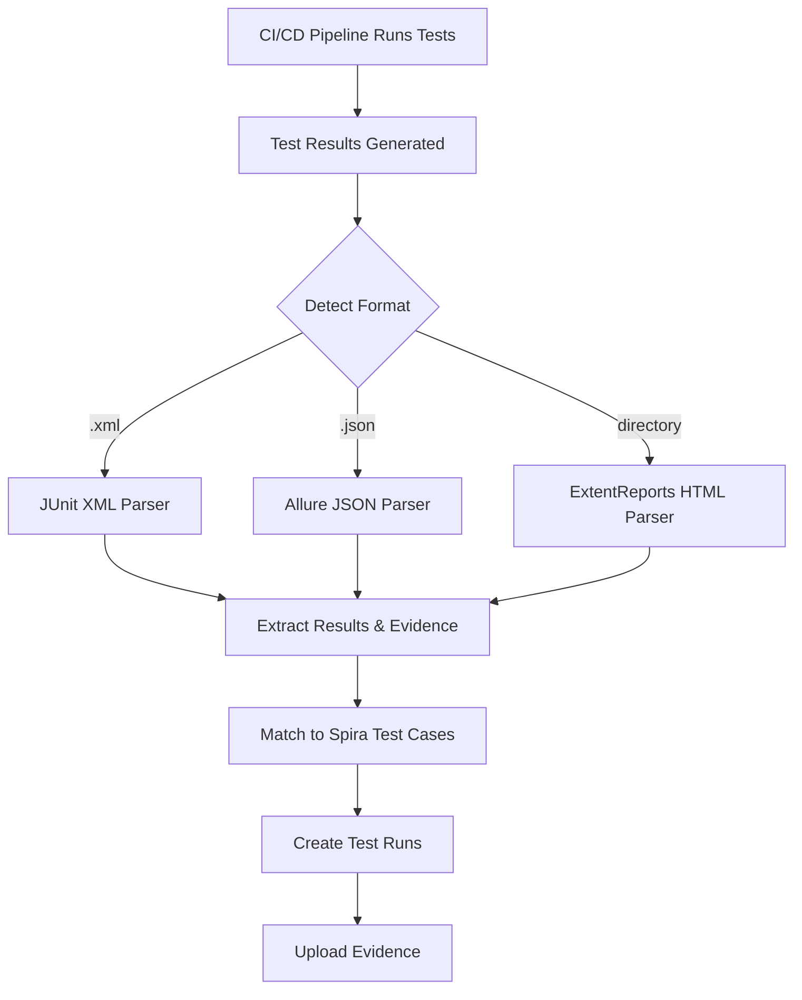

# Spira CI/CD Test Integration

Parse test results from any CI/CD pipeline and send them to Spira test management -- automatically.

```bash
pip install git+https://github.com/dermotcanniffe/SpiraUniversalReporter.git
spira-report ./test-results/
```

## What It Does

- Auto-detects test result format (Allure JSON, JUnit XML, ExtentReports HTML)
- Matches tests to Spira test cases via custom properties -- no test code changes needed
- Creates test runs with pass/fail status, timestamps, errors, and stack traces
- Uploads evidence (screenshots, videos, logs) as attachments
- Auto-creates test cases in Spira when new tests appear
- Pluggable parser architecture -- add support for any format



## Quick Start

1. Set your Spira credentials as environment variables (see [Configuration](docs/configuration.md))
2. Point the tool at your test results:

```bash
spira-report ./test-results/       # explicit path
spira-report                       # auto-discovers from SPIRA_RESULTS_DIR or cwd
spira-report --preflight           # validate setup without sending results
```

## Documentation

| Guide | Description |
|-------|-------------|
| [Getting Started](docs/getting-started.md) | Installation, first run, preflight validation |
| [Configuration](docs/configuration.md) | Environment variables, .env setup, API key |
| [CI/CD Integration](docs/ci-cd-integration.md) | GitLab, GitHub Actions, Jenkins, Azure DevOps examples |
| [Parsers](docs/parsers.md) | Supported formats, what's extracted, custom parser guide |
| [Test Case Matching](docs/tc-matching.md) | Custom property flow, regex fallback, test set linkage |
| [Architecture](docs/architecture.md) | Project structure, plugin system, data models |

## Known Limitations

- Test set linkage requires TCs to be pre-added to the test set in Spira (REST API limitation). The tool logs a warning with a direct Spira link when a TC isn't in the specified test set.
- `SPIRA_TEST_SET_ID` is optional. Test runs are created regardless -- they just won't be grouped under a test set if the TC isn't a member.

## License

TBD